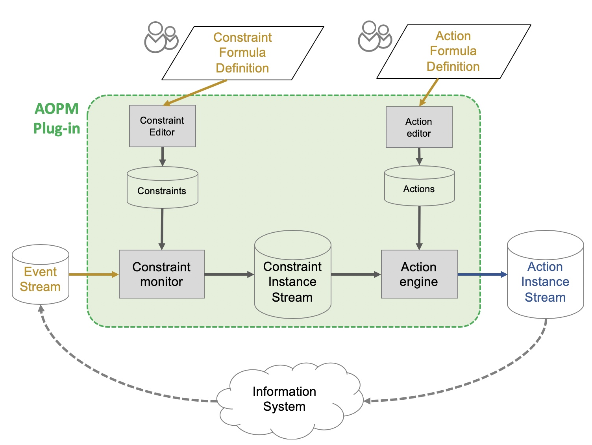
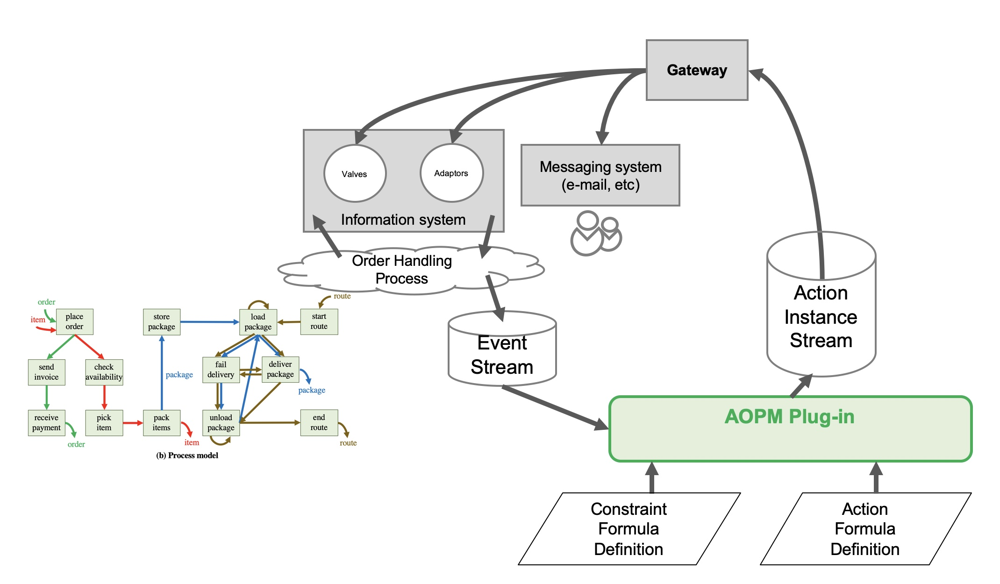

- (*Last updated on 25. May. 2020)*

  ## 0. Overview

  Process mining has provided techniques to extract process-oriented knowledge from event data available in information systems. They have been successfully adopted to solve process-related problems in a diverse domains including healthcare, manufacturing, logistics, etc. Nowadays, the attention of the process mining discipline has shifted to the support of continuous process management and the actual process improvement.

  This ProM plugin implements a general framework for action-oriented process mining that supports the continuous management of operational processes and the automated execution of actions to improve the process.

  ## 1. Tool Description

  
  This figure shows the overview of _AOPM_ plug-in. It transforms **the event stream**, which is continuosly generated by information systems, into **the action instance stream**, which describes mitigating actions that needs to be applied in the information systems. More in detail, the constraint monitor evaluates a set of constraints, defined with different diagnostics, by analyzing the continuously updated event data. As a result, it generates a constraint instance stream that is the description of (non) violations of these constraints. By analyzing it, the action engine assesses the necessity of actions and generate required actions, including valves at process level, adaptors at instance level and alert, for the process improvement.

  To that end, it takes an event stream, a constraint formula definition, and a action formula definition. In return, it generates an action instance stream. Detailed information about input and output is as follows:

  ### Input

  - Event stream

    - An event stream is in XML format, storing object-centric events introduced in the paper. Each event may refer to different objects from different object classes. The XML Schema is described in Appendix.

    - Example

      ```
      <?xml version="1.0" encoding="UTF-8"?>
      <event-stream>
      <event event-id="889923">
        <process-id>OH</process-id>
        <activity-id>place_order</activity-id>
        <resource-id>Jane</resource-id>
        <timestamp>1</timestamp>
        <object-mapping>
          <object-class type="Order">
            <object-id>o1</object-id>
            <object-id>o2</object-id>
          </object-class>
          <object-class type="Item">
            <object-id>i1</object-id>
            <object-id>i2</object-id>
          </object-class>
        </object-mapping>
      </event>
      </event-stream>
      ```

  - Constraint formula definitions (CFD)

    - The constraint formulas are defined by *Constraint Formula Definition Language (CFDL)*. The syntax is explained below.

    - Example

      ```
      DEFINE "cf1"  AS
      CONTEXT "omap"={"Order":{"foreach"}}
      FILTER "event"
      EVALUATE "Throughput", <, 72; 
      ```

  - Action formula definitions (AFD)

    - The action formulas are defined by *Action Formula Definition Language (AFDL)*.

    - Example

      ```
      DEFINE "af1" AS
      VIEW "cf"={"cf1"} & "Order"={"foreach"}
      ASSESS "count",>,0
      OPERATION "Set higher priority"
      PARAMETER "target"="Order";
      ```

  ### Output

  - Action instance stream (AIS)

    - An action instance stream is in XML format, storing action instances. The XML schema for AIS is described in Appendix.

    - Example

      ```
      <?xml version="1.0" encoding="UTF-8"?>
      <action-instance-stream>
      <action-instance>
        <action-formula>a1-set_higher-priority-for-delayed-orders</action-formula>
        <operation>Set_higher_priority</operation>
        <parameter-mapping>
          <parameter name="target">
            <value>Order</value>
          </parameter>
        </parameter-mapping>
        <timestamp>1</timestamp>
      </action-instance>
      </action-instance-stream>
      ```

  ### How to

  1. Run AOPM plug-in on ProM framework
  2. Configure file paths to the event stream, CFD, and AFD.
  3. Configure constraints by selecting a constraint formula and specifying when to monitor it.
  4. Configure actions by selecting an action formula and specifying when to execute it.
  5. Run it.

  ## 2. Experimental environment

  To facilitate the test of the framework, we provide an experimental environment with an information system simulating an order handling process. Description about the process:

  - There are 16 available resources in total at any time and each of them is responsible for multiple activities in the process. 
  - Orders are randomly placed, and queued for the resource allocation after each activity.
  - The resource is allocated according to *First-in First-out* rule.

  Figure below shows the overview of the experimental environment.
  

  ### How-to

  1. Run _Artificial Information System_ plug-in on ProM framework. 
  2. With that being the input, you can initiate the AOPM plug-in. This time, you don't have to configure a filepath for an event stream. This process is done internally.
  3. Configure constraints by selecting a constraint formula and specifying when to monitor it.
  4. Configure actions by selecting an action formula and specifying when to execute it.
  5. Run it.
  6. The gateway implemented in the information system automatically translates the action instance stream into transactions and updates the information system.

  ## 3. Supported constraint formulas and action formulas

  The list keeps updated.

  ## 4. Appendix

  ### Event Stream Format

  ```
  <?xml version="1.0" encoding="UTF-8" ?>
  <xs:schema xmlns:xs="http://www.w3.org/2001/XMLSchema">
  
  <xs:element name="event-stream">
      <xs:element name="event" maxOccurs="unbounded">
        <xs:complexType>
          <xs:sequence>
            <xs:element name="process-id" type="xs:string"/>
            <xs:element name="activity-id" type="xs:string"/>
            <xs:element name="resource-id" type="xs:string"/>
            <xs:element name="timestamp" type="xs:positiveInteger"/>
            <xs:element name="object-mapping">
              <xs:complexType>
                <xs:element name="object-class" maxOccurs="unbounded">
                  <xs:complexType>
                    <xs:sequence>
                      <xs:element name="object-id" maxOccurs="unbounded">
                    </xs:sequence>
                    <xs:attribute name="type" type="xs:string" use="required"/>
                  </xs:complexType>
                </xs:element>
              </xs:complexType>
            </xs:element>
          </xs:sequence>
          <xs:attribute name="event-id" type="xs:string" use="required"/>
        </xs:complexType>
      </xs:element>
  </xs:element>
  </xs:schema>
  ```

  ### Constraint Formula Definition Language

  We define constraint formulas with the constraint formula definition language. The simplified syntax if as follows:

  ```
  DEFINE <<contraint formula name>> AS
  CONTEXT <<context description>>
  FILTER <<filter description>>
  EVALUATE <<predicate description>>
  ```


  Note that  the filter "event" and "Throughput" are pre-defined in the implementation.

  ### Action Formula Definition Language

  We define action formulas with the action formula definition language. The simplified syntax if as follows:

  ```
  DEFINE <<action formula name>> AS
  ANALYZE <<analysis description>>
  ASSESS <<predicate description>>
  OPERATION <<operation name>>
  PARAMTER <<parameter mapping description>>
  ```

  ### Action Instance Stream Format

  ```
  <?xml version="1.0" encoding="UTF-8" ?>
  <xs:schema xmlns:xs="http://www.w3.org/2001/XMLSchema">
  
  <xs:element name="action-instance-stream">
      <xs:element name="action-instance" maxOccurs="unbounded">
        <xs:complexType>
          <xs:sequence>
            <xs:element name="action-formula" type="xs:string"/>
            <xs:element name="operation" type="xs:string"/>
            <xs:element name="parameter-mapping">
              <xs:complexType>
                <xs:element name="parameter" maxOccurs="unbounded">
                  <xs:complexType>
                    <xs:sequence>
                      <xs:element name="value" maxOccurs="unbounded">
                    </xs:sequence>
                    <xs:attribute name="name" type="xs:string" use="required"/>
                  </xs:complexType>
                </xs:element>
              </xs:complexType>
            </xs:element>
            <xs:element name="timestamp" type="xs:positiveInteger"/>
          </xs:sequence>
        </xs:complexType>
      </xs:element>
  </xs:element>
  </xs:schema>
  ```

  ## Remark

  - contact gnpark@pads.rwth-aachen.de for more information